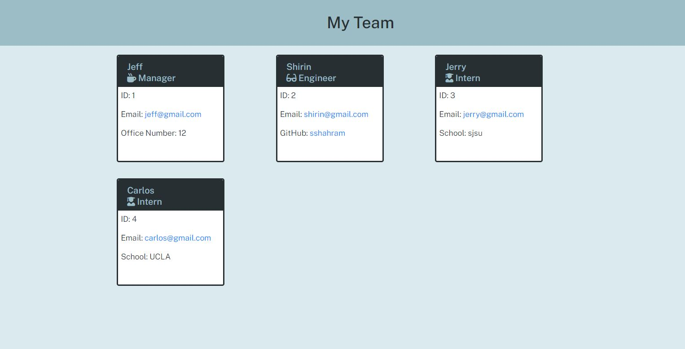

# Team Profile Generator

## Description

This project uses Node.js command-line application that takes in information about employees and generates an HTML webpage that displays summaies for each person.

## Table of Contents
* [Description](#description)
* [Table of Contents](#table-of-contents)
* [Installation](#installation)
* [User-Story](#user-story)
* [Acceptance-Criteria](#acceptance-criteria)
* [Tests](#tests)
* [Screenshots](#screenshots)
* [Video](#Video)
* [Questions](#questions)

## Installation
Please see below for installation requirements:

Please first install node.js and then run the following command into your terminal: npm install

## User-Story
As a manager, I want to generate a webpage that displays my team's basic info, so that I have quick access to their emails and GitHub profiles

## Acceptance-Criteria
* When I am prompted for my team members and their information, then an HTML file is generated that displays a nicely formatted team roster based on user input
* When I click on an email address in the HTML, then my default email program opens and populates the TO field of the email with the address
* When I click on the GitHub username, then that GitHub profile opens in a new tab
* When I start the application, then I am prompted to enter the team manager’s name, employee ID, email address, and office number
* When I enter the team manager’s name, employee ID, email address, and office number, then I am presented with a menu with the option to add an engineer or an intern or to finish building my team
* When I select the engineer option, then I am prompted to enter the engineer’s name, ID, email, and GitHub username, and I am taken back to the menu
* When I select the intern option, then I am prompted to enter the intern’s name, ID, email, and school, and I am taken back to the menu
* When I decide to finish building my team, then I exit the application, and the HTML is generated

## Tests
You can use the following methods to test the application:
* Enter command "npm run test" in your terminal. This command will run the tests written for this application.
* Run command "node index" multiple time in your terminal. Each time include or exclude some sections and checkout the results.

## Screenshots
Here is the snapshot of "Team Profile Generator" webpage:

## Video
Please click on the following link to see the Demo video for this project:
[Link to Demo](https://drive.google.com/file/d/1HW6Z2OTQddUFQXMTCZcvI2U_hxUce8Zu/view)

## Questions
If you have any questions please use the following two links to contact me:

* https://github.com/sshahram

* shirin.shahram23@gmail.com
